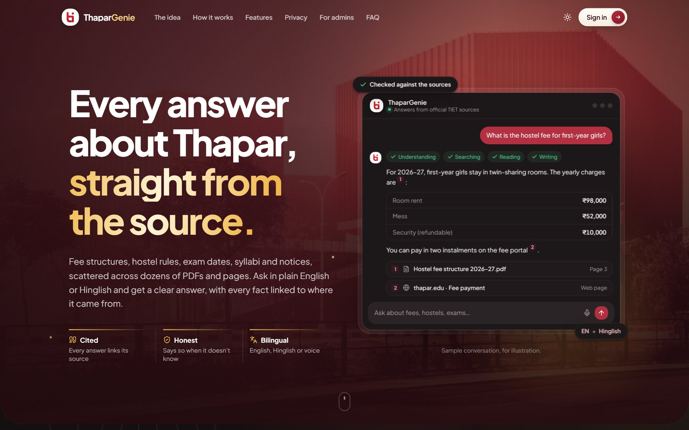
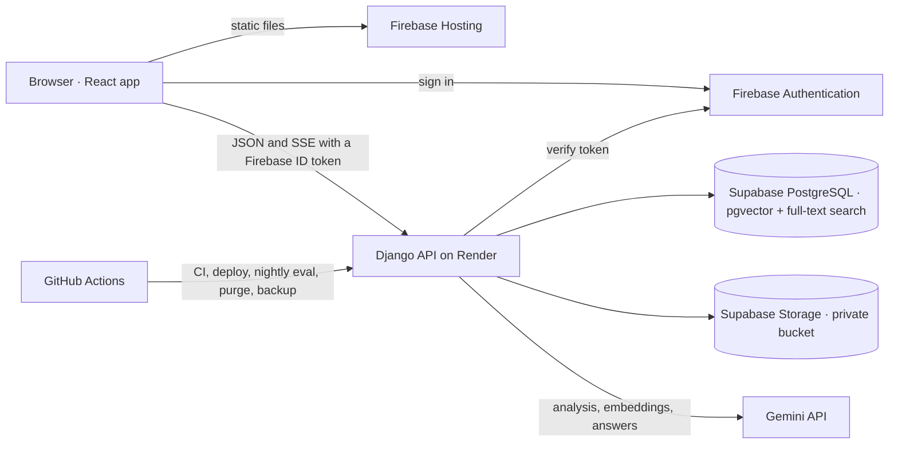

<p align="center">
  <a href="https://thapargenie.divyanshuagrahari.dev"></a>
</p>

<p align="center">
  <b>Every answer about Thapar, straight from the source.</b><br/>
  A campus assistant that answers from official TIET documents and links every fact to its source.
</p>

<p align="center">
  <a href="https://github.com/Divyanshu2805/thapargenie/actions/workflows/ci.yml"></a>
  
  
  
  
  
  
</p>

<p align="center">
  <a href="https://thapargenie.divyanshuagrahari.dev"><b>thapargenie.divyanshuagrahari.dev</b></a>
</p>

---

Students at Thapar Institute of Engineering and Technology (TIET) look for fees, hostel
rules, cutoffs, calendars and syllabi across dozens of pages and PDFs. **ThaparGenie**
answers the question directly, from the official documents, with a numbered link to every
source it used, and says so plainly when the documents do not cover it.

Admins run the knowledge base, review feedback, see which questions went unanswered and
post notices from a separate dashboard.

## Try it

| | |
|---|---|
| **Live app** | [thapargenie.divyanshuagrahari.dev](https://thapargenie.divyanshuagrahari.dev) |
| **Getting in** | Register with an email and verify it. New accounts are approved by an admin; when the admins have switched approval off, a verified `thapar.edu` address gets in directly and any other address still waits |
| **First request** | The API runs on a free instance. If it has been idle, the first request can take up to a minute |

## Features

**Asking**
- Questions in English or Hinglish, with follow-ups understood from the chat
- Streamed answers with a citation on every fact; each opens the official page or file
- Every figure in an answer (amounts, years, dates) is checked against the sources it
  cites, and the answer is flagged when one is not found
- A line saying which academic session the sources cover, with a warning for outdated ones
- An honest "I couldn't find this" with where to look, instead of a guess
- "List all" questions load the whole page, so no item is left out
- Follow-up suggestions on request, voice input, and starter questions

**Conversations**
- History across devices with search, pin, archive and rename
- Branches: regenerate an answer or edit a question and flip between versions
- Download as Markdown, print, or share one answer as a public link that lasts 7 days
- Notices from admins, a "What can I ask?" page, site feedback, light and dark themes,
  and install as an app

**Admin dashboard**
- Documents: upload PDF, Word, Excel, CSV, HTML or text, add a web page by URL, edit
  details, act on 100 at once, view and edit individual passages
- Insight: usage, answer outcomes, latency, AI spend against a daily budget, feedback
  review, unanswered questions, and a nightly search-quality score with regression warnings
- A playground that shows how any question was analysed, searched and answered
- Users and invitations, notices, runtime settings, CSV exports and an audit log
- Two-factor sign-in for staff

Everything, with its limits: [features](docs/features.md).

## How an answer is made

1. **Admit.** The daily limit, the AI budget and one-stream-per-student are checked, and
   the question is saved before anything else, so it is never lost.
2. **Understand.** One fast model call classifies the message and rewrites it as a
   standalone English question with alternative phrasings and keywords.
3. **Search.** Vector search (pgvector) and Postgres full-text search run side by side and
   are merged with reciprocal rank fusion.
4. **Build sources.** The best passages are merged with their neighbours into numbered
   sources within a token budget.
5. **Answer.** The chat model streams an answer from those sources only, citing them.
6. **Check.** Every figure is matched against the cited sources; the answer, its sources
   and a trace of each step are stored.

A greeting, a personal-record request or an off-topic question never reaches search, and
the first question of a chat can be served from a semantic cache.
More: [asking a question](docs/architecture/flows/asking-a-question.md).

## Architecture

A Django API and a React single-page app. They talk JSON over HTTPS; answers stream as
server-sent events. Everything durable is in one PostgreSQL database, where search runs
too: there is no separate vector store, queue or cache server.



The decisions behind it, each with what it was chosen over:

| Decision | Why |
|---|---|
| [Hybrid search inside PostgreSQL](docs/architecture/decisions/0002-hybrid-search-inside-postgres.md) | Loose questions and exact course codes both found, in one system and one transaction |
| [Server-sent events over fetch](docs/architecture/decisions/0004-server-sent-events-over-fetch.md) | Streaming over plain HTTP, with a bearer token |
| [Conversations as a tree](docs/architecture/decisions/0007-messages-as-a-tree.md) | Regenerate and edit without losing what was said |
| [Citations stored as snapshots](docs/architecture/decisions/0008-citation-snapshots.md) | Old answers stay readable after a document is replaced |
| [Background work in the web process](docs/architecture/decisions/0005-in-process-background-work.md) | No queue service to run; state in the database survives restarts |
| [Staff two-factor inside the app](docs/architecture/decisions/0012-staff-two-factor-in-the-app.md) | A stolen password alone never reaches the admin API |

More: [architecture overview](docs/architecture/README.md) ·
[security model](docs/architecture/security-model.md) ·
[all thirteen decisions](docs/architecture/decisions/README.md)

## Measured

| What | Measured |
|---|---|
| Search quality | recall@5 between **0.94 and 1.00** and MRR between 0.91 and 1.00 across four scored runs on the production knowledge base, re-scored every night |
| Tests | **572** backend tests, **243** frontend tests and 5 browser journeys; 92% statement coverage of the answer, chat and knowledge code, with an 80% floor in CI |
| Capacity | **400 students** using the app at once on half a CPU with no failed requests, in a load test of 102,194 requests; 8 answers at once at full speed on the free instance production runs on |
| Speed | A full answer in **10.2 s** at the median; the first word in about 8 s, against a target of 3 |
| Accessibility | Lighthouse **100** on every page measured |
| First screen | 218 kB of gzipped JavaScript; every later page loads on demand |

Every figure, with how to re-check it: [project metrics](docs/metrics.md) and
[load testing](docs/load-testing.md).

## Security

- **Identity** comes from a verified Firebase ID token on every request, mapped to one
  account by UID. Accounts need a verified email and approval.
- **Isolation:** a student reaches only their own chats; anyone else's id looks missing.
- **Staff** pass a second step with an authenticator app, are granted only from the command
  line, and need a fresh sign-in for anything irreversible.
- **Privacy:** the model never receives who is asking, question text is never logged, and
  admins see feedback under a pseudonym. Old data is deleted on a schedule, and students
  can export or delete their chats.
- **Untrusted input:** file types come from content, URLs are fetched only from allowlisted
  domains with every redirect checked, documents are treated as data and never as
  instructions, and answers render without raw HTML.
- **Operations:** production settings refuse to start unsafe, dependencies are pinned and
  audited in CI, the history is scanned for secrets, and backups are encrypted.

The rules are in the [security model](docs/architecture/security-model.md) and the
[security guardrails](docs/practices/security-guardrails.md). Found a problem? See
[SECURITY.md](SECURITY.md).

## Tech stack

| Layer | Technologies |
|---|---|
| API | Python 3.13, Django 5.2, Django REST Framework, gunicorn |
| Data | PostgreSQL 17 with pgvector (`halfvec(768)`, HNSW) and full-text search |
| Models | Google Gemini for analysis, answers and embeddings; an OpenAI adapter behind the same interface |
| Web app | React 19, Vite 8, Tailwind CSS 4, Radix UI, TanStack Query, React Router |
| Sign-in and files | Firebase Authentication, Supabase Storage |
| Quality | pytest, Vitest, Playwright, ruff, ESLint, Locust, GitHub Actions |

Details and versions: [tech stack](docs/tech-stack.md).

## Quick start

Requires Python 3.13, Node 24, Docker, a Firebase project and a Gemini API key.

```bash
git clone https://github.com/Divyanshu2805/thapargenie.git
cd thapargenie
docker compose up -d db                       # PostgreSQL with pgvector

# API
python -m venv Backend/.venv
source Backend/.venv/bin/activate             # Windows: Backend\.venv\Scripts\activate
pip install -r Backend/requirements-dev.txt
cp Backend/backend/.env.example Backend/backend/.env    # then fill it in
cd Backend/backend
python manage.py migrate
python manage.py createcachetable
python manage.py runserver

# Web app, in another terminal
cd Frontend
cp .env.example .env.local                    # Firebase web config and the API URL
npm ci
npm run dev
```

The app is on <http://localhost:5173> and the API on <http://127.0.0.1:8000>. Approving
your account, becoming an admin and adding a knowledge base are in
[local development](docs/local-development/README.md), which also covers running with no
Gemini key at all.

### Commands

```bash
pytest                                   # backend tests, from the repository root
cd Frontend && npm test                  # frontend tests
python manage.py ask "question" --trace  # one question through the pipeline, step by step
python manage.py eval_rag                # score search quality
```

The full list is in [commands](docs/local-development/commands.md).

## Repository layout

```
Backend/backend/
  backend/        settings per environment, URL root, gunicorn entry
  userauths/      users, profiles, invitations
  api/            Firebase token checks, identity mapping, /me, health, audit events
  common/         shared building blocks: throttles, event streams, safe URL fetching, logging
  knowledge/      documents and passages, storage, the ingestion pipeline
  rag/            model clients, analysis, hybrid search, the answer pipeline, evaluation
  chat/           conversations, the streaming chat API, quotas, cache, admin statistics
  access/         user and invitation management, staff two-factor
  notices/        announcements
Frontend/
  src/features/   one folder per feature: chat, admin, landing, notices, settings, ...
  src/lib/        request wrapper, stream reader, API calls
  e2e/            Playwright journeys
loadtest/         the load-test stack and its scripts
docs/             documentation
.github/workflows/  CI, the frontend deploy, scheduled jobs
```

## Deployment

The web app is on Firebase Hosting, the API on Render and the database on Supabase, both in
Singapore. Work merges into `dev`; a release is one pull request from `dev` into `main`,
and once CI passes there the API and the web app deploy themselves. GitHub Actions also
runs the scheduled jobs against production: a nightly search-quality score, a daily purge
of expired data, a weekly encrypted backup and a weekly re-read of web pages.

See [deployment](docs/deployment/README.md) and [operations](docs/deployment/operations.md).

## Known limitations

The first word of an answer takes about 8 seconds, not the 3 that was aimed for. The API
runs on a free instance that sleeps when idle and serves about 8 answers at once at full
speed. Rate limits are counted per worker process. Backups are weekly and a restore has not
been drilled. Not built: personal records (those stay in Webkiosk), languages beyond
English and Hinglish, offline use, email notifications, college single sign-on and a
staging environment. Details, and the answer-quality problems found and fixed so far, are
in [known gaps](docs/known-gaps/README.md).

## Documentation

Everything lives in [`docs/`](docs/README.md):

| Section | Covers |
|---|---|
| [Features](docs/features.md) | Everything the app does, with its limits |
| [Local development](docs/local-development/README.md) | Setup, configuration, commands, troubleshooting |
| [Architecture](docs/architecture/README.md) | The parts, request flows, security model, decision records |
| [Data model](docs/schema/README.md) | Tables, indexes, conventions, retention |
| [API reference](docs/api/README.md) | Every endpoint, the event stream, errors and rate limits |
| [Engineering practices](docs/practices/README.md) | Conventions, testing, guardrails, pitfalls, definition of done |
| [Project metrics](docs/metrics.md) · [Load testing](docs/load-testing.md) | Measured quality, speed and capacity |
| [Known gaps](docs/known-gaps/README.md) | Trade-offs, what is not built, answer-quality history |
| [Deployment](docs/deployment/README.md) · [Operations](docs/deployment/operations.md) | Running it in production |
| [Contributing](CONTRIBUTING.md) · [Security](SECURITY.md) | Workflow and checks; reporting a vulnerability |

## License

Released under the [MIT License](LICENSE).
