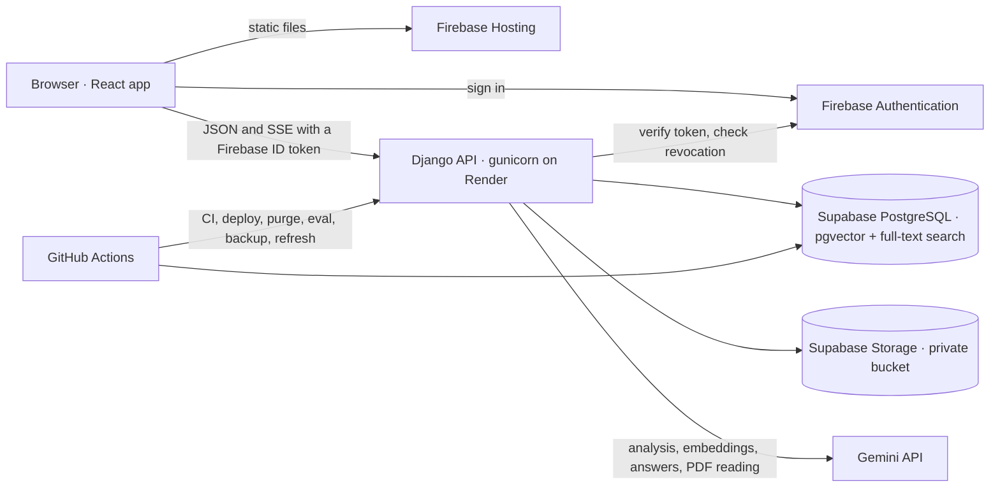

# Architecture

ThaparGenie is two deployable parts: a Django API (`Backend/backend`) and a React
single-page app (`Frontend`). They talk JSON over HTTPS, except answers, which stream as
server-sent events. Everything durable lives in one PostgreSQL database; uploaded originals
live in a private storage bucket.

## Where it runs

| Part | Host |
|---|---|
| Web app | Firebase Hosting, at [thapargenie.divyanshuagrahari.dev](https://thapargenie.divyanshuagrahari.dev) |
| API | Render web service, Singapore: gunicorn, 2 workers of 8 threads |
| Database and uploaded files | Supabase, Singapore |
| Sign-in | Firebase Authentication, in a project separate from development |
| Answers and embeddings | Google Gemini API (an OpenAI adapter is included) |
| Scheduled jobs | GitHub Actions: daily purge and search-quality check, weekly encrypted backup and re-read of web pages |

How a change reaches production is in [deployment](../deployment/README.md).

## Backend apps

| App | Owns |
|---|---|
| `userauths` | The user model (bound to a Firebase UID), the student profile and invitations |
| `api` | Firebase token verification, identity mapping, `/me`, health checks, the audit event model, the error envelope |
| `common` | Shared building blocks with no models: mixins, throttles, server-sent events, the SSRF-safe fetcher, logging context, CSV export, retention and database lockdown commands |
| `knowledge` | Documents and passages, file storage, the ingestion pipeline and its background jobs |
| `rag` | The model clients, query analysis, hybrid search, reranking, source building, the answer pipeline, grounding and the evaluation harness |
| `chat` | Conversations as a message tree, the streaming chat API, quotas, the answer cache, memory, sharing, feedback, and the admin statistics |
| `access` | Admin endpoints for users, invitations and the audit log, and staff two-factor sign-in |
| `notices` | Announcements, optionally mirrored into the knowledge base |

`chat` builds on `rag`, and `rag` searches the passages `knowledge` owns. `knowledge` in
turn calls `rag/llm` to embed passages and read scanned PDFs, and reads the runtime
settings and AI budget that `chat` keeps. Three boundaries are strict:

- `rag/pipeline.py` saves nothing and knows nothing about HTTP. `chat/answering.py` is the
  only place that turns its events into stored messages.
- Only `rag/llm` imports a model vendor's SDK.
- Only `api/firebase.py` talks to the Firebase Admin SDK.

Each app keeps the same file layout: `models.py`, `services.py` for writes that must be
audited, `views.py` and `urls.py` for students, `admin_views.py` and `admin_urls.py` for
staff, `retention.py` for what `purge_data` deletes, and `tests/`.

## Web app

`Frontend/src` is split by feature.

| Path | Holds |
|---|---|
| `features/chat` | The chat home, a conversation, the composer, messages, sources, search, share, export |
| `features/admin` | The dashboard pages, loaded as a separate chunk students never download |
| `features/landing`, `help`, `notices`, `feedback`, `settings`, `privacy`, `shared` | One page each |
| `auth`, `views/auth`, `utils` | Firebase sign-in, the session and the authenticated API client |
| `lib` | The fetch wrapper, the event-stream reader, API calls by area, query client, small helpers |
| `components` | The app shell and sidebar, and `ui/` primitives (shadcn/ui on Radix) |

Server state is held by TanStack Query; there is no global store. The first screen ships
in one bundle and every later page is loaded on demand.

## Read next

- [Asking a question](flows/asking-a-question.md): from the request to a stored, cited answer.
- [Ingestion](flows/ingestion.md): from an upload to searchable passages.
- [Sign-in and access](flows/authentication.md): tokens, approval, staff and two-factor.
- [Security model](security-model.md): the boundaries and where each is enforced.
- [Decisions](decisions/README.md): why the system is shaped this way.
- [Where to change things](where-to-change.md): the file to open for a given task.
