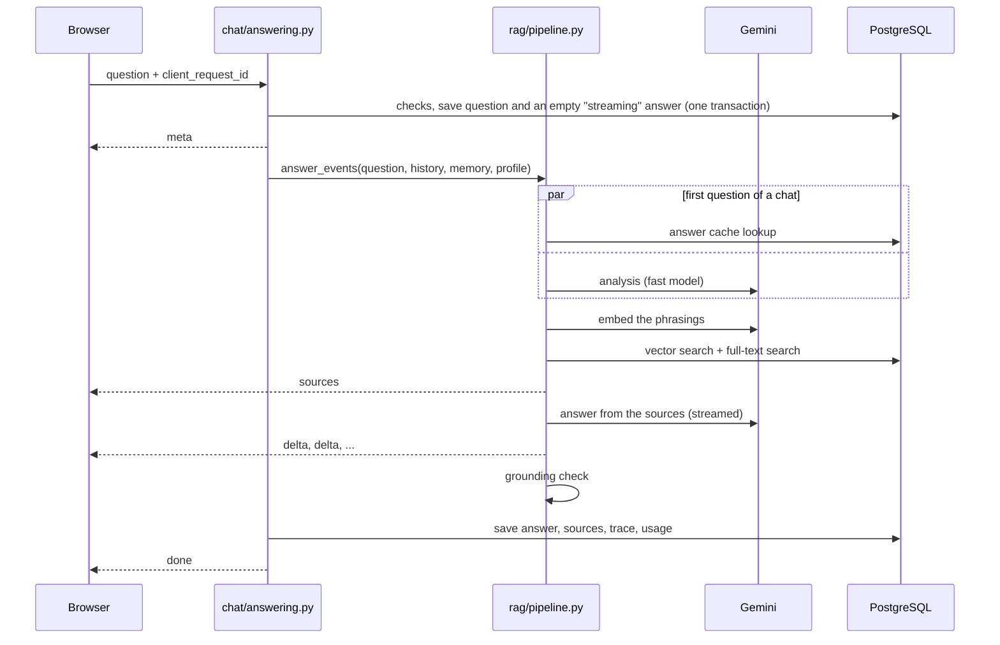

# Asking a question

From `POST /api/v1/conversations/<id>/messages/` to a stored, cited answer. Two modules do
the work: `chat/answering.py` owns admission checks and persistence, and `rag/pipeline.py`
turns a question into events without saving anything.

## 1. Admission (`chat/answering.py: start_turn`)

One transaction, with the conversation row locked:

1. **Idempotency.** A request whose `client_request_id` was seen before replays what it
   produced; it never creates a second question.
2. **Maintenance mode** refuses students with the admin's message.
3. **Daily limit.** The student's usage row for today is locked, which also serialises two
   sends from the same student. Staff are not limited.
4. **Global AI budget.** When today's AI calls across everyone reach the budget, asking
   pauses with `service_busy`.
5. **One stream per student.** A stream started in the last 4 minutes blocks a second one.
6. **Conversation size**: at most 200 messages.

Then the question and an empty answer marked `streaming` are saved. A question is therefore
never lost, even if the server dies during generation.

## 2. The pipeline (`rag/pipeline.py: answer_events`)

| Step | Module | What happens |
|---|---|---|
| Cache | `chat/cache.py` | First question of a chat only. The raw question is embedded and compared with cached questions while analysis runs; cosine similarity of 0.97 or more returns the stored answer and sources at once |
| Analysis | `rag/analysis.py` | One fast-model call returns the intent, a standalone English question, up to two other phrasings, keywords, likely categories, the academic session, whether current data matters and whether a complete list is wanted. If the call fails, the raw question is searched |
| Routing | `rag/pipeline.py` | A greeting, a personal-record question or an off-topic request gets a fixed reply. Mid-chat, thanks or a remark about an earlier answer gets a short reply from the chat alone (`rag/conversation.py`), with no search |
| Search | `rag/retrieve.py` | Up to three phrasings are embedded and searched with pgvector in one SQL round trip; the keywords, with Thapar abbreviations expanded (`rag/aliases.py`), go through Postgres full-text search on a second connection at the same time. Reciprocal rank fusion (k = 60) merges the lists of 40 |
| Boosts | `rag/retrieve.py` | A matching category, a current document and a matching session each add at most 10% of the best fused score. Near-duplicate passages (85% word overlap) are dropped. 25 candidates remain |
| Rerank | `rag/rerank.py` | Off by default. The fast model scores the top 15 from 0 to 10; those under 3 are dropped, except that the two best fused candidates are only dropped at 0 |
| Sources | `rag/context.py` | The best 8 passages become numbered sources. Neighbouring passages from one document merge into one source, and a passage cut mid-table brings its neighbour. Budget: about 6,000 tokens. For a "list all" question, when at least 3 and at least half of the kept passages share a document, that whole document is loaded under a 12,000-token budget |
| Answer | `rag/prompt.py` | The chat model streams an answer from the sources only, citing them as `[n]`. It sees the last 4 messages and a rolling summary of older ones |
| Grounding | `rag/grounding.py` | Every figure in the answer (amounts, years, sessions, dates in any common format) must appear in a source it cites. Any that do not are recorded and the answer is flagged |

A reply that begins "I couldn't find" or cites nothing is stored as `no_answer`, which is
what feeds the admin's knowledge-gaps page.

## 3. Finishing (`chat/answering.py: stream_turn`)

- **Done.** The answer, a snapshot of each source, a trace (analysis, candidates with their
  ranks, timings per stage) and token counts are saved in one transaction. A grounded, cited
  first answer is added to the cache. Two background jobs follow: a short title for the chat
  and, once enough messages have built up, an updated summary.
- **Stopped.** If the browser goes away, what was written is kept and marked `stopped`.
- **Failed.** A model outage or an exhausted quota marks the answer `failed`, gives the
  question back to the student's daily count, and sends an `error` event that says whether
  retrying makes sense.

Streams left `streaming` by a crash are marked failed after 10 minutes.

## Model failures

`rag/llm/client.py` retries transient errors up to 3 times with backoff, honouring the
provider's retry delay, then falls back from the chat model to the fast model. Once any
text has reached the student, a failure is surfaced instead of silently restarting.

## Streaming transport

`common/sse.py` runs the pipeline in a worker thread and sends a comment line every 15
seconds, so proxies do not close an idle connection while the model thinks. The event
format is in the [chat API](../../api/chat.md#streaming).

## Conversations as a tree

Messages link to a parent (`chat/engine.py`). Regenerating adds a sibling answer; editing a
question adds a sibling question. The conversation's `current_leaf` marks the branch on
screen, and the history sent to the model is the chain from the root to that leaf.

## Measuring it

`manage.py ask "question" --trace` prints every step for one question. `manage.py eval_rag`
scores search against `rag/eval/golden.json`; see [testing](../../practices/testing.md#search-quality).
