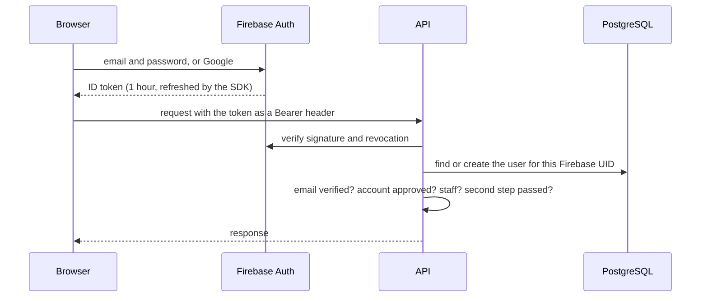

# Sign-in and access

Firebase Authentication proves who someone is. The API decides what they may do. No
password ever reaches the API.

## Every request (`api/authentication.py`)

1. The token is verified with the Firebase Admin SDK: signature, audience, issuer, expiry
   (with 10 seconds of clock drift allowed), an allowed sign-in provider (password or
   Google) and a well-formed email.
2. Firebase is asked whether the session was revoked or the account disabled. For students
   a token Firebase confirmed in the last 60 seconds is trusted without asking again; for
   staff it is checked on every request.
3. The token maps to exactly one local user by Firebase UID (`api/identity.py`). An
   existing account is never linked by email, and a clash is refused for an admin to review.
4. The local account must be active, and the sign-in must be newer than the last "sign out
   on all devices".

## Approval

A new account starts `pending`. It becomes `approved` in one of three ways:

- an admin approves it from **Users & invites**;
- its verified email matches an invitation;
- approval is switched off in admin settings, and the verified email is on an allowed
  domain (`OPEN_ACCESS_EMAIL_DOMAINS`, default `thapar.edu`). Any other address still waits.

Every student endpoint requires a verified email and an approved account
(`HasVerifiedEligibleIdentity`). `GET /me/` is the exception: it answers anyone signed in,
so the app can show the right status screen.

## Staff

Staff access is granted only from the command line (`grant_firebase_staff`), with a reason,
and is audited. The dashboard cannot make someone staff, and an admin cannot change their
own access or another staff member's.

### Two-factor (`access/two_factor.py`)

After signing in, staff enter a 6-digit code from an authenticator app before the admin API
answers. Until then every admin endpoint except `two-factor/…` returns 403 with
`second_factor_setup_required` or `second_factor_required`.

- The first visit walks through enrolment and shows ten backup codes, once.
- A passed check is tied to that sign-in (the token's `auth_time`) and lasts 12 hours.
- A code is accepted for the current 30-second step and the one on either side, and never
  twice.
- Five wrong codes lock the step for five minutes.
- The app's key is stored encrypted with a key derived from `DJANGO_SECRET_KEY`; backup
  codes are stored as keyed hashes.

Recovery and the emergency switch are in [operations](../../deployment/operations.md#staff-two-factor).

## Recent sign-in

Irreversible actions need a sign-in from the last 5 minutes: every admin delete, deleting
all chats, new backup codes and signing out everywhere. The web app asks the user to
confirm their identity and retries.

## In the browser

`src/auth/AuthContext.jsx` tracks the Firebase user and loads `/me/`.
`src/utils/apiClient.js` attaches a fresh token to every request and retries once with a
forced refresh on a 401. `PrivateRoute` and `AdminRoute` choose between the app, a status
screen and the sign-in page; they are a convenience, and the API enforces everything again.
