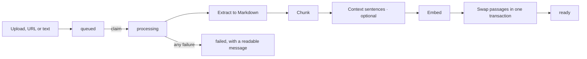

# Ingestion

How a document becomes searchable passages. Adding a document
(`knowledge/services.py`) stores the original in the private bucket, saves a row marked
`queued` and hands it to a background thread (`knowledge/jobs.py`). The work itself is in
`knowledge/ingest/pipeline.py`.

## Steps

1. **Claim.** The row moves from `queued` to `processing` in one `UPDATE`, so a document
   is never processed twice, even with several workers.
2. **Extract** (`ingest/extract.py`). The file type comes from the bytes, never the name
   or the browser's MIME type (`ingest/filetypes.py`). PDFs use their text layer; scans and
   pages with under 200 characters are read by the model in 20-page windows ("smart"
   parsing, automatic or forced per document). Word, Excel, CSV and HTML files and web
   pages become Markdown, with tables kept as tables. Encrypted PDFs are refused.
3. **Chunk** (`ingest/chunk.py`). Markdown is split along headings into passages of about
   450 tokens with a 60-token overlap inside a section. Tables are kept whole up to 1,200
   tokens and split by rows beyond that, each part repeating the header row. Every passage
   carries its heading breadcrumb and page range.
4. **Context** (optional, `ingest/contextualize.py`). One sentence per passage saying where
   it sits in the document, written by the fast model in batches of 10. It goes into the
   search text only; answers are always written from the original passage. Documents over
   150 passages skip this step unless it is run by hand.
5. **Embed.** The search text (title, category, department, headings, session, the context
   sentence, the passage, and expanded abbreviations) is embedded in batches of 50 as
   768-dimension vectors.
6. **Swap.** Old passages are replaced by the new ones in one transaction, so a document
   stays answerable while it is reprocessed. The swap clears the answer cache.

## Failure and recovery

A failure leaves the document `failed` with a message the admin can read. Nothing is lost
on a restart: state lives in the database, and a recovery loop in every server process
re-queues anything `queued` or stuck in `processing` for over 15 minutes, every 5 minutes.
`manage.py process_documents` drains the queue by hand.

## Crawler import

`manage.py import_crawler_export <folder>` loads the thapar.edu crawler export
(`chunks.jsonl.gz`): one document per page, the crawler's own chunks kept as they are, and
only the embedding done here. It is resumable; a page whose content is already stored is
skipped. `--dry-run` shows what would be imported and `--contextualize` writes context
sentences on the way in.

`manage.py contextualize_documents` adds context sentences to pages already stored, without
the export: it reads each page once and re-embeds only the passages it wrote for. Use
`--dry-run` first; `--limit` and `--title` allow a trial, and `--include-long` covers pages
over 150 passages.

## Keeping documents current

- **Valid until.** A document can carry a last valid day. After it, the document and its
  passages are marked not current, which ranks them lower. A sweep in the server process
  does this every 5 minutes; the daily maintenance job covers days the server sleeps.
- **Web pages.** `manage.py refresh_web_pages` fetches every page added by URL and
  re-processes only those whose readable text changed, compared by a fingerprint that
  ignores markup. A page that cannot be fetched keeps its stored passages. It runs weekly.
  Crawler-imported pages have no stored source and change only by importing a new export.
- **Editing.** Changing a document's details updates its passages at once; changing a
  field that is part of the search text, or editing a passage, re-embeds what changed.

## Fetching URLs safely

Pages are fetched through `common/safe_http.py`: HTTPS only, hosts on the allowlist
(`INGEST_URL_ALLOWLIST`), every resolved address public, the connection made to an address
that was checked, at most 5 redirects each re-validated, and the body capped while it
streams.
