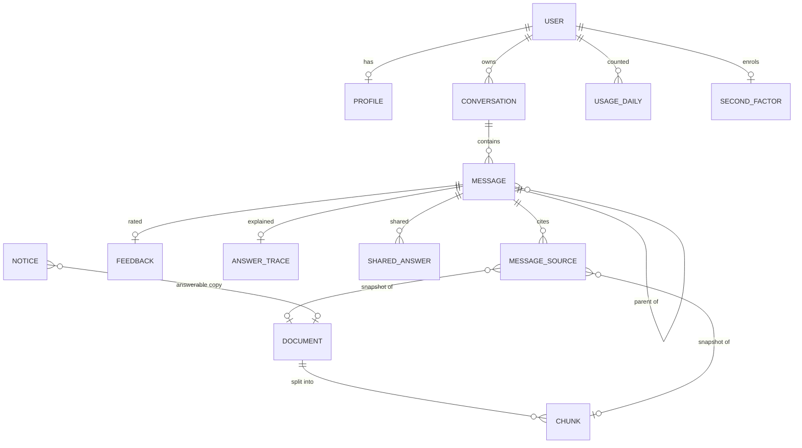

# Data model

One PostgreSQL database with the `vector` (pgvector) and `pg_trgm` extensions, created by
the first `common` migration. 20 models across 7 apps, 15 migrations.

## Tables

### Identity and access

| Table | Holds |
|---|---|
| `userauths_user` | An account: email (unique, case-insensitive), Firebase UID (unique), eligibility state (`pending`, `approved`, `denied`, `suspended`), staff flag, and the time before which sign-ins are no longer accepted |
| `userauths_profile` | Optional campus, programme and year of study |
| `userauths_identityinvitation` | An invited email, its expiry and who accepted it |
| `access_second_factor` | A staff member's authenticator key (encrypted), hashed backup codes, the last accepted time step and lockout counters |
| `access_second_factor_session` | One sign-in that passed the second step, and when |
| `api_auditevent` | Who did what to which resource, with what outcome. Metadata only |

### Knowledge

| Table | Holds |
|---|---|
| `knowledge_document` | One row per document: title, source type, storage path, content hash (unique), category, department, session, effective and valid-until dates, current flag, status, parser, counts |
| `knowledge_chunk` | A searchable passage: the text, its search text, heading breadcrumb, pages, a `halfvec(768)` embedding and a generated full-text column. Category, department and the current flag are copied from the document so search needs no join |
| `notices_notice` | An announcement: title, body, importance, pin, draft flag, publish and expiry times, an optional link, and a link to its knowledge-base copy |

### Chat

| Table | Holds |
|---|---|
| `chat_conversation` | A chat: owner, title, pin and archive flags, the current leaf message, the rolling summary and what it covers |
| `chat_message` | A question or answer in a tree (`parent`): content, status, answer type, the grounding result, model, token counts, latency, the idempotency key and saved follow-up suggestions |
| `chat_messagesource` | A snapshot of each source an answer was given, readable after the document is deleted |
| `chat_feedback` | A thumbs up or down with reason and comment, and the admin's review |
| `chat_sitefeedback` | Feedback about the site, with the student's consent to be contacted |
| `chat_sharedanswer` | A share link: token, copies of the question, answer and sources, expiry and revocation time |
| `chat_answertrace` | How an answer was produced: analysis, candidates with ranks, timings |
| `chat_answercache` | Cached first answers with the question's embedding |
| `chat_usagedaily` | Counters per user per day: questions, answers, cache hits, AI calls, tokens. No content |
| `chat_chatsettings` | One row of runtime settings (a check constraint keeps it at one row) |
| `rag_evalrun` | One scored run of the search-quality questions |

`django_cache` backs the default cache (the coverage summary and audit de-duplication).

## Indexes that matter

| Index | For |
|---|---|
| HNSW on `knowledge_chunk.embedding` (cosine, searchable rows only) | Vector search |
| GIN on `knowledge_chunk.fts` | Full-text search |
| HNSW on `chat_answercache.query_embedding` | Cache lookup |
| Trigram GIN on conversation and document titles | Title search |
| `(user, is_archived, is_pinned, -last_message_at)` on conversations | The sidebar |
| Unique `(conversation, client_request_id)` on messages | Idempotent sends |
| Unique `(user, day)` on usage | The daily limit under concurrency |

## Conventions

- **UUID primary keys** on everything students or admins can address; users keep integer
  ids.
- **Choices are enforced twice**: in serializers and by a `CHECK` constraint
  (`common/mixins.py: choices_check`), so a bad value cannot be written from a shell either.
- **Text limits on `TextField`s** are also `CHECK` constraints (`max_length_check`).
- **Timestamps** are stored in UTC; `created_at` and `updated_at` come from
  `TimestampedModel`.
- **Deleting a user or a conversation cascades** to everything that holds their content.
  Usage counters and audit events survive with the user set to null.
- **Migrations are backwards compatible**: add a column as nullable first and remove it in a
  later release, so a rollback never needs a schema downgrade. CI fails if models and
  migrations disagree.
- **Row level security** is switched on for every table by `secure_database`, with no
  policies, so only the database owner (the API) can read them.

## Retention

`manage.py purge_data` runs daily and is safe to run at any time; `--dry-run` reports what
would go. Each run leaves one audit event with the counts.

| Data | Kept for | Setting |
|---|---|---|
| Chats with no activity (with their messages, sources, feedback and traces) | 180 days | `RETENTION_CONVERSATION_DAYS` |
| Answer traces | 30 days | `RETENTION_TRACE_DAYS` |
| Cached answers | 7 days, or until the knowledge base changes | fixed |
| Usage counters | 400 days (13 months) | `RETENTION_USAGE_DAYS` |
| Audit events | 365 days | `RETENTION_AUDIT_DAYS` |
| Site feedback | 365 days | `RETENTION_SITE_FEEDBACK_DAYS` |
| Notices | 365 days after they expire; ones that never expire stay | `RETENTION_NOTICE_DAYS` |
| Documents that failed processing | 30 days | `RETENTION_FAILED_DOCUMENT_DAYS` |
| Share links | 30 days after they expire or are switched off | fixed |
| Stored files with no document row | Removed once a day old | fixed |
| Passed two-factor checks | 12 hours | `STAFF_TWO_FACTOR_SESSION_HOURS` |

The same run marks answers stuck in `streaming` for over 10 minutes as failed.

Changing a retention period means updating the privacy notice at `/privacy` as well.
